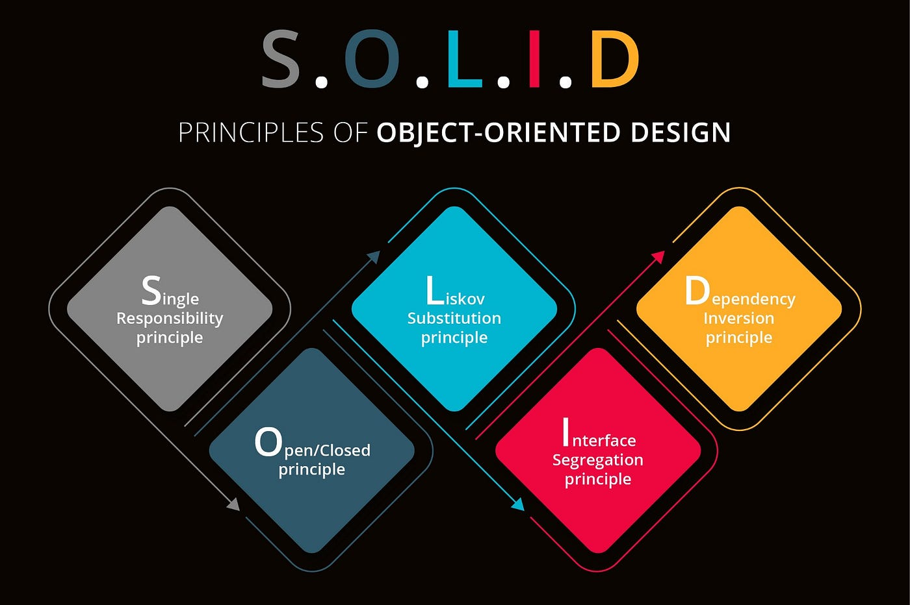

# ShortMyUrl

[](https://dotnet.microsoft.com/en-us/download/dotnet/8.0)
[](https://www.mongodb.com/)
[](https://www.docker.com/)
[](LICENSE)
[]()


**ShortMyUrl** é uma aplicação web desenvolvida em .NET 8 para encurtamento de URLs, com backend em ASP.NET Core e persistência de dados no MongoDB. Ideal para criar, gerenciar e redirecionar links curtos de forma rápida e eficiente.

## 🚀 Tecnologias

- .NET 8 (ASP.NET Core)
- MongoDB
- Docker & Docker Compose
- Swagger (para testes e documentação da API)

## 📁 Arquitetura do Projeto

[](https://github.com/Felipe-Amorim-Dev/ShortMyUrl-DOTNET/docs/?repo=Felipe-Amorim-Dev%2ShortMyUrl-DOTNET)

<p>O projeto segue uma arquitetura modular baseada em camadas, com princípios de Domain-Driven Design (DDD) e separação de responsabilidades, facilitando manutenção, testes e escalabilidade.

**ShortMyUrl.API**
Camada de apresentação com ASP.NET Core Web API. Responsável por receber requisições HTTP, validar entradas e retornar respostas apropriadas. Utiliza Swagger para documentação automática da API.

ShortMyUrl.Domain
Contém a lógica de negócio (serviços de domínio e regras de validação). É independente de tecnologias externas, promovendo baixo acoplamento.

ShortMyUrl.Data
Camada de persistência de dados. Responsável por interagir com o MongoDB, utilizando repositórios genéricos e entidades persistentes.
</p>



## 🛠️ Como rodar o projeto

### Pré-requisitos

- [.NET SDK 8](https://dotnet.microsoft.com/en-us/download/dotnet/8.0)
- [Docker](https://www.docker.com/)
- [MongoDB Compass](https://www.mongodb.com/products/compass) (opcional)

### MongoDB Container (independente)

Primeiro crie a rede interna do docker
```bash
docker network create nome-da-sua-network
```
Depois crie o container para o mongoDb

```bash
docker run -d --name mongodb-container -p 27017:27017 --network nome-da-sua-network mongo
```

### Rodando a API

Abra um terminal onde o arquivo **docker-compose.yml** está e rode o comando abaixo:

```bash
docker compose up --build
```

Acesse em: [http://localhost:8081/swagger](http://localhost:8081/swagger)

## 🔧 Configurações

```yaml
# docker-compose.yml (exemplo)
services:
  shortmyurl-api:
    ...
    environment:
      - MongoDbSettings__ConnectionString=mongodb://mongodb-container:27017
    networks:
      - shortmyurl-network

networks:
  shortmyurl-network:
    name: shortmyurl-network
```

## 📁 Estrutura

- `ShortMyUrl.API` — Camada de apresentação (Controllers e configurações).
- `ShortMyUrl.Domain` — Regras de negócio.
- `ShortMyUrl.Data` — Repositórios e acesso ao MongoDB.

## 📜 Licença

Este projeto está licenciado sob a licença MIT.

